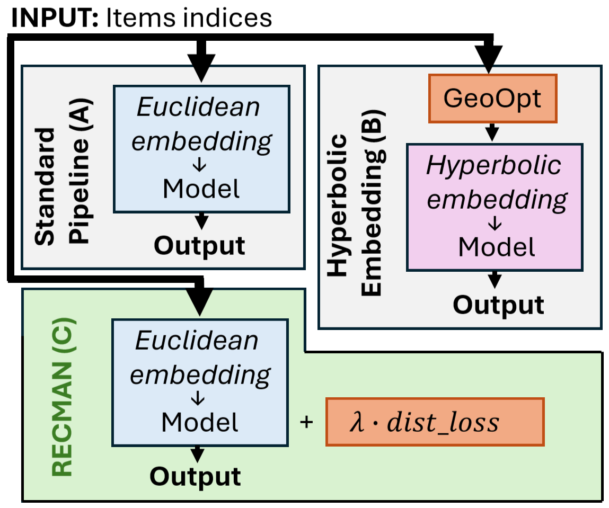

This repository contains the source code for the paper **Learning Geometry-Aware Recommender Systems 
with Manifold Regularization (RecSys 2025)**. It includes implementations of:
- **SASRec** and variants (`SASRec+`, `SASRec_man`, `SASRec+_man`)
- **HypSASRec** and variants (`HypSASRec+`)
- **NCF** and variants (`NCF+geoopt`, `HyperML`)


<details>
          <summary>Implementation Notes</summary>
          <p>
                This work extends and modifies the following open-source implementations:
                
- Hyperbolic-SASRec (https://github.com/AIRI-Institute/Hyperbolic-SASRec);
- NCF (https://github.com/guoyang9/NCF).

Original licenses and source code are preserved in their repositories.

</p>
</details>

---

## 🔍 Proposed Approach (RECMAN)

Our approach enhances recommender systems through soft manifold regularization, 
enabling geometric learning without architectural changes. Unlike hyperbolic approaches
that require Riemannian optimization, RECMAN preserves standard training via a novel
regularization term in the loss function. It natively supports hybrid geometries—
combining Euclidean user embeddings with hyperbolic item embeddings for users and Poincaré ball distances for items—while handling 
sequences through pairwise distance matrices. The method avoids computational 
overhead by applying constraints through the loss (with a tuned dispersion ratio λ)
rather than modifying the optimizer. As shown in the approach diagram, this maintains
model architecture integrity while enforcing geometric relationships.

<p align="center">

</p>

## Results

📌 **Bold** are best result in category  

### NCF Performance
Our RECMAN variant with manifold regularization 
outperformed baseline NCF models across both explicit and implicit feedback tasks:

| Dataset       | Model      | MSE (Explicit) | Binary Acc. | HR@10 (Implicit) | NDCG@10 |
|---------------|------------|----------------|-------------|------------------|---------|
| **MovieLens1M** | NCF        | 0.0322         | 0.6878      | 0.722            | 0.547   |
|                | NCF+geoopt | 0.0324         | 0.6840      | 0.563            | 0.318   |
|                | **RECMAN** | **0.0320**     | **0.6927**  | **0.741**        | **0.531** |
| **Pinterest**   | NCF        | n/a            | n/a         | 0.834            | 0.502   |
|                | **RECMAN** | n/a            | n/a         | **0.836**        | **0.505** |

***Pinterest results are for implicit feedback only. RECMAN shows consistent improvements 
in both settings.***

## SASRec and SASRec+ Architecture Evaluation Results


📈 Relative improvements compare to  SASRec/SASRec+

| Dataset    | Model          | HR@10 | MRR@10 | NDCG@10 | COV@10 | Improvement vs SASRec+ | Improvement vs SASRec |
|------------|----------------|-------|--------|---------|--------|------------------------|-----------------------|
| **Arts**   | SASRec+        | **0.074** | **0.040** | **0.048** | **0.338** | - | +27% HR, +38% MRR |
|            | HypSASRec+     | 0.051 | 0.028 | 0.033 | 0.246 | - | - |
|            | RECMAN+ (Ours) | 0.068 | 0.039 | 0.046 | 0.219 | -8% HR | **+17% HR, +33% MRR** |
| **Digital**| SASRec+        | 0.061 | 0.028 | 0.035 | 0.506 | - | +44% HR, +41% MRR |
|            | HypSASRec+     | 0.059 | 0.028 | 0.035 | **0.541** | - | - |
|            | RECMAN+ (Ours) | **0.063** | **0.028** | **0.036** | 0.466 | **+3% HR** | **+44% HR, +41% MRR** |
| **Luxury** | SASRec+        | 0.131 | 0.067 | 0.082 | 0.563 | - | +12% HR |
|            | HypSASRec+     | 0.132 | 0.064 | 0.080 | **0.589** | - | - |
|            | RECMAN+ (Ours) | **0.138** | **0.073** | **0.088** | 0.391 | **+5% HR, +8% MRR** | **+16% MRR, +15% NDCG** |
| **MovieLens**| SASRec+      | 0.168 | 0.063 | 0.087 | **0.787** | - | +10% HR |
|            | HypSASRec+     | 0.169 | 0.063 | 0.088 | 0.751 | - | - |
|            | RECMAN+ (Ours) | **0.169** | **0.064** | **0.088** | 0.686 | +1% HR | **+14% MRR, +12% NDCG** |
| **Office** | SASRec+        | 0.097 | 0.063 | 0.071 | 0.298 | - | +97% HR |
|            | HypSASRec+     | 0.088 | 0.054 | 0.062 | 0.430 | - | - |
|            | RECMAN+ (Ours) | **0.103** | **0.066** | **0.073** | **0.431** | **+7% HR, +45% COV** | **+146% MRR, +123% NDCG** |

The results demonstrate that our RECMAN+ architecture achieves competitive or superior performance across all datasets, with particularly significant 
improvements over the original SASRec (up to +146% MRR and +123% NDCG), while maintaining comparable efficiency to SASRec+

## 🚀 Code Usage -  Quick Start

### SASRec/SASRec+

---

### 1. Download Datasets
Run the following command to download and preprocess datasets:

``` bash
python scripts/get_data.py --dataset NAME
```

Supported datasets (```NAME```):

- ```ml1m``` (MovieLens 1M)

- ```Digital_Music```

- ```Arts_Crafts_and_Sewing```

- ```Grocery_and_Gourmet_Food```

- ```ffice_Products```

- ```Luxury_Beauty```

### 2. Organize Data

Move the downloaded data to the correct folder:
``` bash
cp -r scripts/data/raw data/raw
```

---

### 🔧 Reproducing Experiments

###  Grid Search (Pre-Completed)
We provide pre-tuned hyperparameters for manifold regularization. 
The original grid search was run via:

``` bash
python tune.py --model sasrec_manifold --dataset %dataset_name% --time_offset 0.95 \
               --config_path ./grids/sasrec_manifold.py --grid_steps 60 --dump_results
```

###  Run Models with Best Configs

Execute the following for each model and dataset combination:

``` bash
python test.py --model %model% --dataset %dataset_name% --time_offset 0.95 \
               --config_path ./grids/best/sasrec_%dataset_alias%.py --grid_steps 60 --dump_results
```


#### Model Options (`%model%`):
| Model               | Alias             |
|---------------------|-------------------|
| SASRec              | `sasrec`          |
| SASRec+             | `sasrecb`         |
| SASRec_man          | `sasrec_manifold` |
| SASRec+_man         | `sasrecb_manifold`|
| HypSASRec           | `hybsasrecb`      |
| HypSASRec+          | `hypsasrec`       |

#### Dataset Mappings:
| Dataset Name (`%dataset_name%`)   | Alias (`%dataset_alias%`) |
|-----------------------------------|---------------------------|
| `ml1m`                            | `ml1m`                    |
| `Digital_Music_5`                 | `dig`                     |
| `Arts_Crafts_and_Sewing_5`        | `arts`                    |
| `Grocery_and_Gourmet_Food_5`      | `grocery`                 |
| `Office_Products_5`               | `office`                  |
| `Luxury_Beauty_5`                 | `lux`                     |

---
### NCF

---
### Setup
1. Download datasets from the original NCF repository: 

```bash
   git clone https://github.com/hexiangnan/neural_collaborative_filtering
```

### Configuration

Edit ```config.py``` to specify:

```python
dataset = 'ml-1m'  # or 'pinterest-20'
model = 'MLP'      # Options: 'MLP' | 'GMF' | 'NeuMF-pre'
```

### Running Experiments
Run each model with optimal manifold regularization values:

| Model       | Command                          | λ Value  |
|-------------|----------------------------------|----------|
| **MLP**     | `python main.py --lambda_man 1e-6` | `1e-6`   |
| **GMF**     | `python main.py --lambda_man 0`    | `0`      |
| **NeuMF-pre** | `python main.py --lambda_man 1e-6` | `1e-6`   |


## Execution Order

```bash
# 1. MLP
sed -i "s/model = .*/model = 'MLP'/" config.py
python main.py --lambda_man 1e-6

# 2. GMF 
sed -i "s/model = .*/model = 'GMF'/" config.py
python main.py --lambda_man 0

# 3. NeuMF-pre
sed -i "s/model = .*/model = 'NeuMF-pre'/" config.py
python main.py --lambda_man 1e-6
```

## Notes

- For `pinterest-20`, ensure the dataset files are in `Data/pinterest-20/`;

- λ values were determined through grid search (see paper for details).


## Citation
If you use this code, please cite our RecSys 2025 paper:

``` latex
@inproceedings{Zainulabidova2025,
  author = {Zainulabidova, Zaira and Borisova, Julia and Hvatov, Alexander},
  title = {Learning Geometry-Aware Recommender Systems with Manifold Regularization},
  booktitle = {Proceedings of the 19th ACM Conference on Recommender Systems (RecSys '25)},
  year = {2025},
  location = {Prague, Czech Republic},
  pages = {5},
  publisher = {ACM},
  address = {New York, NY, USA},
  doi = {10.1145/3705328.3759323},
  url = {https://doi.org/10.1145/3705328.3759323},
  series = {RecSys '25}
}
```

## Contacts

In case of any questions feel free to [contact us](mailto:alex_hvatov@itmo.ru) or open an issue in this repository.